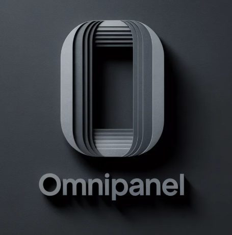

<p align="center">
  
</p>

<h1 align="center">OmniPanel</h1>

<p align="center">
  <strong>All your AI assistants. One side panel. Zero tab clutter.</strong>
</p>

<p align="center">
  <a href="#-features"></a>
  <a href="https://github.com/YASHGUPTA-007/OmniPanel--Extension/blob/main/LICENSE"></a>
  <a href="#-installation"></a>
  <a href="#"></a>
</p>

<br>


---

## 🧠 What is OmniPanel?

**OmniPanel** is a Chrome extension that gives you instant access to **5 major AI chatbots** — **Gemini**, **ChatGPT**, **Claude**, **DeepSeek**, and **Grok** — directly inside Chrome's native side panel. No more juggling tabs. No more copy-pasting between AI tools. Just click, switch, and chat.

> Think of it as a command center for AI, always one click away while you browse.

---

## ✨ Features

### 🤖 Multi-AI Access
| Provider | URL | Status |
|:--------:|:---:|:------:|
| **Gemini** | `gemini.google.com` | ✅ Fully Supported |
| **ChatGPT** | `chatgpt.com` | ✅ Fully Supported |
| **Claude** | `claude.ai` | ✅ Fully Supported |
| **DeepSeek** | `chat.deepseek.com` | ✅ Fully Supported |
| **Grok** | `grok.com` | ✅ Fully Supported |

### 🔄 Session Persistence
Your chat sessions are automatically saved per provider. Switch between AI tools and come back to exactly where you left off — no reloading, no lost conversations.

### 🔍 Zoom Controls
Built-in zoom controls let you adjust the AI interface to your preferred size. Zoom in, zoom out, or reset — using buttons or keyboard shortcuts.

### 🎤 Smart Voice Mode Handling
Voice features that aren't compatible with the side panel environment are gracefully handled with user-friendly notifications instead of confusing errors.

### 📌 Floating Recents Button
A floating button on Claude provides quick access to recent chats and sidebar navigation without leaving the side panel.

### 🧩 Iframe Pooling Architecture
Instead of destroying and recreating iframes when switching providers, OmniPanel uses an **iframe pool** — each provider's iframe stays alive in the background. This means:
- ⚡ **Instant switching** between AI providers
- 💾 **Chat state preserved** across switches
- 🚀 **No reload delays**

### 🔒 Header Modification Rules
Declarative net request rules handle `X-Frame-Options`, `CSP`, and `CORS` headers automatically, ensuring all AI providers load seamlessly inside the side panel iframe.

---

## 📦 Installation

### Method 1: Load Unpacked (Developer Mode)

> **Recommended for development and personal use**

1. **Clone the Repository**
   ```bash
   git clone https://github.com/YASHGUPTA-007/OmniPanel--Extension.git
   ```

2. **Open Chrome Extensions Page**
   - Navigate to `chrome://extensions/` in your Chrome browser
   - Or go to **⋮ Menu → Extensions → Manage Extensions**

3. **Enable Developer Mode**
   - Toggle the **"Developer mode"** switch in the top-right corner

4. **Load the Extension**
   - Click **"Load unpacked"**
   - Select the cloned `OmniPanel--Extension` folder

5. **Pin the Extension**
   - Click the 🧩 **Extensions** icon in Chrome's toolbar
   - Click the 📌 **Pin** button next to **OmniPanel**

6. **Start Using**
   - Click the **OmniPanel** icon in your toolbar
   - The side panel will open with Gemini loaded by default
   - Click any AI provider icon to switch!

### Method 2: Download ZIP

1. Go to the [**Releases**](https://github.com/YASHGUPTA-007/OmniPanel--Extension/releases) page (or click **Code → Download ZIP**)
2. Extract the ZIP file to a folder on your computer
3. Follow steps **2–6** from Method 1 above

---

## 🎮 Usage

### Switching AI Providers
Click any provider icon in the top navigation bar to instantly switch between AI assistants:

| Icon | Provider | Shortcut |
|:----:|:--------:|:--------:|
| ✦ | Gemini | — |
| ◉ | ChatGPT | — |
| ⬟ | Claude | — |
| ☻ | DeepSeek | — |
| ✕ | Grok | — |

### Zoom Controls

| Action | Keyboard Shortcut | Button |
|:------:|:-----------------:|:------:|
| Zoom In | `Ctrl` + `+` | `[+]` button |
| Zoom Out | `Ctrl` + `-` | `[-]` button |
| Reset Zoom | `Ctrl` + `0` | — |

> Zoom level is saved and persists across sessions.

---

## 🏗️ Project Structure

```
OmniPanel/
├── manifest.json        # Extension configuration (Manifest V3)
├── background.js        # Service worker — side panel behavior & message relay
├── sidepanel.html       # Main side panel UI
├── sidepanel.css        # Dark theme styling with CSS variables
├── sidepanel.js         # Core logic — provider switching, zoom, session state
├── injector.js          # Content script — text injection & session URL tracking
├── antidetect.js        # Claude-specific — recents button & voice mode handling
├── rules.json           # Declarative net request rules (header modifications)
├── permission.html      # Microphone permission request page
├── permission.js        # Microphone permission handler
├── image.png            # Extension icon (128×128)
└── image copy.png       # Extension screenshot
```

---

## ⚙️ How It Works

### Architecture Overview

```
┌─────────────────────────────────────────────────────┐
│                   Chrome Browser                     │
│  ┌───────────────────────────────────────────────┐  │
│  │              Side Panel (sidepanel.html)       │  │
│  │  ┌─────────────────────────────────────────┐  │  │
│  │  │  Header: [Logo] [Gemini][ChatGPT]...    │  │  │
│  │  │          [Claude][DeepSeek][Grok] [±]   │  │  │
│  │  ├─────────────────────────────────────────┤  │  │
│  │  │                                         │  │  │
│  │  │  ┌─────────┐  (hidden iframes)          │  │  │
│  │  │  │ Active  │  ┌─────────┐               │  │  │
│  │  │  │ iframe  │  │ Hidden  │ ...           │  │  │
│  │  │  │(Gemini) │  │(ChatGPT)│               │  │  │
│  │  │  └─────────┘  └─────────┘               │  │  │
│  │  │                                         │  │  │
│  │  └─────────────────────────────────────────┘  │  │
│  └───────────────────────────────────────────────┘  │
│                                                     │
│  ┌──────────────┐  ┌──────────────┐  ┌───────────┐  │
│  │background.js │  │ injector.js  │  │rules.json │  │
│  │(Service      │  │(Content      │  │(Header    │  │
│  │ Worker)      │◄─┤ Script)      │  │ Rules)    │  │
│  └──────────────┘  └──────────────┘  └───────────┘  │
└─────────────────────────────────────────────────────┘
```

### Key Components

| Component | Role |
|:---------:|:----:|
| **`background.js`** | Service worker that opens the side panel on icon click and relays messages between components |
| **`sidepanel.js`** | Manages iframe pool, provider switching, zoom level, and session persistence via `chrome.storage` |
| **`injector.js`** | Content script injected into AI provider pages for text input and URL change detection |
| **`antidetect.js`** | Runs in the `MAIN` world on Claude pages to add UI enhancements and handle voice mode |
| **`rules.json`** | Strips restrictive headers (`X-Frame-Options`, `CSP`, etc.) so sites load in iframes |

---

## 🔐 Permissions Explained

| Permission | Why It's Needed |
|:----------:|:---------------:|
| `sidePanel` | Opens the extension in Chrome's side panel |
| `declarativeNetRequest` | Modifies response headers to allow iframe embedding |
| `declarativeNetRequestFeedback` | Provides debugging feedback for net request rules |
| `storage` | Saves session state, last provider, and zoom level |
| `scripting` | Injects content scripts dynamically when needed |
| `activeTab` | Accesses the current tab for text injection features |
| `host_permissions: <all_urls>` | Required to modify headers for all AI provider domains |

---

## 🛠️ Development

### Prerequisites
- **Google Chrome** (v116+ recommended for side panel API)
- Basic knowledge of Chrome Extension APIs (Manifest V3)

### Local Development

```bash
# Clone the repo
git clone https://github.com/YASHGUPTA-007/OmniPanel--Extension.git
cd OmniPanel--Extension

# Load in Chrome
# 1. Open chrome://extensions/
# 2. Enable Developer Mode
# 3. Click "Load unpacked" → select this folder

# After making changes:
# Click the 🔄 refresh button on the extension card in chrome://extensions/
```

### Making Changes

| File Changed | Reload Required |
|:------------:|:---------------:|
| `manifest.json` | Full extension reload |
| `background.js` | Click refresh on extension card |
| `sidepanel.*` | Close & reopen side panel |
| `injector.js` | Refresh the AI provider tab |
| `antidetect.js` | Refresh Claude tab |
| `rules.json` | Full extension reload |

---

## 🤝 Contributing

Contributions are welcome! Here's how to get started:

1. **Fork** the repository
2. **Create** a feature branch
   ```bash
   git checkout -b feature/amazing-feature
   ```
3. **Commit** your changes
   ```bash
   git commit -m "feat: add amazing feature"
   ```
4. **Push** to your branch
   ```bash
   git push origin feature/amazing-feature
   ```
5. **Open** a Pull Request

### Ideas for Contribution
- 🌐 Add more AI providers (e.g., Perplexity, Copilot, Mistral)
- 🎨 Custom themes / light mode support
- ⌨️ Keyboard shortcuts for provider switching
- 📋 Cross-provider prompt sharing
- 🔔 Notification support for AI responses
- 📱 Responsive layout improvements

---

## ❓ FAQ

<details>
<summary><strong>Why does the extension need "Access to all websites"?</strong></summary>
<br>
OmniPanel needs to modify HTTP response headers (like <code>X-Frame-Options</code> and <code>Content-Security-Policy</code>) from AI provider domains so their pages can load inside the side panel iframe. The <code>&lt;all_urls&gt;</code> permission is required by the <code>declarativeNetRequest</code> API for this purpose. <strong>OmniPanel does NOT read, collect, or transmit any of your browsing data.</strong>
</details>

<details>
<summary><strong>Why is voice mode disabled for Claude?</strong></summary>
<br>
Claude's voice mode requires direct access to microphone APIs that aren't fully supported within an iframe/side panel context. OmniPanel gracefully disables voice buttons and shows a notification suggesting you open Claude in a full tab for voice features.
</details>

<details>
<summary><strong>My chat sessions aren't being saved?</strong></summary>
<br>
Session persistence works by tracking URL changes within the AI provider iframes. If you clear Chrome's extension storage or reinstall the extension, saved sessions will be lost. Sessions are stored locally via <code>chrome.storage.local</code>.
</details>

<details>
<summary><strong>Can I use this with other Chromium browsers?</strong></summary>
<br>
OmniPanel should work with any Chromium-based browser that supports the Side Panel API (Chrome 116+). This includes <strong>Microsoft Edge</strong>, <strong>Brave</strong>, and <strong>Vivaldi</strong> (with varying levels of support).
</details>

<details>
<summary><strong>An AI provider shows a blank/white screen?</strong></summary>
<br>
Try these steps:
<ol>
  <li>Click the provider button again to reload</li>
  <li>Close and reopen the side panel</li>
  <li>Go to <code>chrome://extensions/</code> and click the refresh button on OmniPanel</li>
  <li>Make sure you're logged into the AI provider in a regular tab first</li>
</ol>
</details>

---

## 📄 License

This project is open source and available under the [MIT License](LICENSE).

---

## 🌟 Show Your Support

If you find OmniPanel useful, please consider:

- ⭐ **Starring** the repository
- 🐛 **Reporting bugs** via [Issues](https://github.com/YASHGUPTA-007/OmniPanel--Extension/issues)
- 💡 **Suggesting features** via [Discussions](https://github.com/YASHGUPTA-007/OmniPanel--Extension/discussions)
- 🔀 **Contributing** via Pull Requests

---

<p align="center">
  Made with ❤️ by <a href="https://github.com/YASHGUPTA-007">Yash Gupta</a>
</p>

<p align="center">
  <sub>OmniPanel is not affiliated with Google, OpenAI, Anthropic, DeepSeek, or xAI. All product names and logos are trademarks of their respective owners.</sub>
</p>
